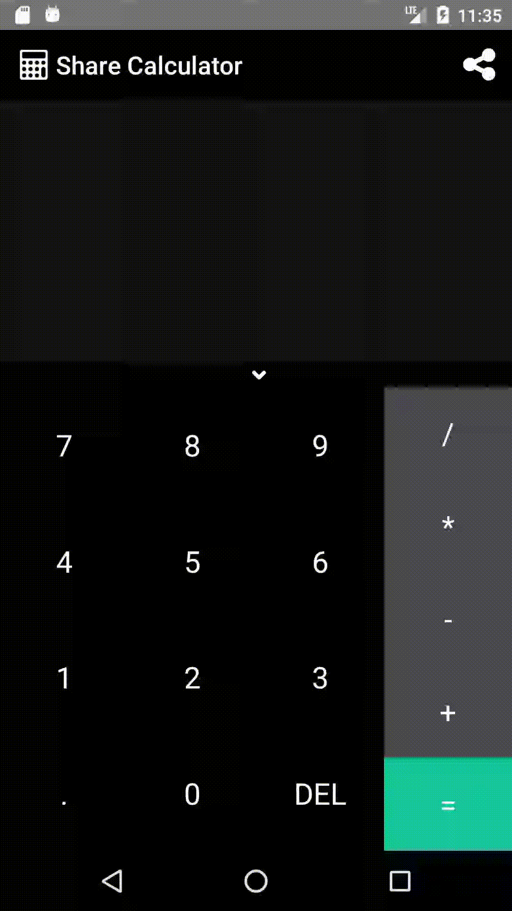

# Share-Calculator

A simple merchant calculator made with React-Native, Redux and Reselect.
This calculator is different from the others because let you share your calculations using the share button :laughing: !

It uses [App Center](https://appcenter.ms) for the deploys.

| Statements | Branches | Functions | Lines |
| -----------|----------|-----------|-------|
|  |  |  |  |

